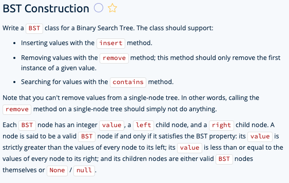

# binary search tree construction

## prompt



## important notes

* Can't remove values from a single-node tree, `remove` does nothing
* a valid BST node: 
  - has a value strictly greater than the values of every node to its left. 
  - It's value is less than or equal to the values of every node to its right
  - children nodes are valid BST nodes or `none` or `null`
  
* If a value is less than a node, the entire right tree can be removed
* If a value is greater than the node, the entire left tree can be eliminated
* 3 operations of a BST. Insertion, Searching, deletion

## searching

1. compare the 1st node to the target node, if it's greater, then we can eliminate entire left subtree. And vice versa.
2. If the value doesn't exist in the BST, we check the final node, after which there are no more nodes to search, we return false because the node wasn't found

## deletion

1. compare the node values like always
2. Easy case: if you find the node you want, and it's a leaf, aka the last node, then you just delete it.
3. What if you just wanted to delete a node `2` with a single child `1`? Grab the node `2` and delete it. Move the child up `1` to the previous position of `2`.
4. Harder case: deleting a node with more than 1 child. You can't just delete a node and then move the child up.
Follow this
* Grab the smallest value in the rightmost subtree and keep track of it => smallestRight
* Delete the value we wanted and replace it with the small subtree value (smallestRight)
  - We do this because any value in the right-most subtree is automatically bigger than any value in the leftmost subtree.
  - We also know that the rightmost smallest value is the smallest value of the right subtree
  - This value is also the easy case to delete because it was the last one and we just replace it with null
- Move the new value to the old values place and delete it from the bottom of the subtree

## Timespace complexity

**Average time**: O(log(n)), at every node we're eliminating a half of a tree. This is a log time complexity
**Worst case time**: O(n). In some cases, there are never any left nodes or right nodes, hence, eliminating a part of the tree isn't happening, and so we need to traverse the entire tree. Here's an example where there is only 1 part of a tree
**Space average:** O(log(n)), O(d) space where d is the depth of the call stack.
**Space worst case:** O(n)

10-12-13-14-15-22-23

## Solution A

**Doesn't work 100% yet**

```c#
using System;

public class Program {
	public class BST {
		public int value;
		public BST left;
		public BST right;

		public BST(int value) {
			this.value = value;
		}

		// Average: O(log(n)) time | O(1) space
		// Worst: O(n) time | O(1) space
		public BST Insert(int value) {
			BST currentNode = this;
			while(true){
				if(value < currentNode.value){
					if(currentNode.left == null){
						BST newNode = new BST(value);
						currentNode.left = newNode;
						break;
					} else
							currentNode = currentNode.left;
					} else {
						if(currentNode.right == null)
						{
							BST newNode = new BST(value);
							currentNode.right = newNode;
							break;
						} else
								currentNode = currentNode.right;
					}
				}
				return this;
			}

		public bool Contains(int value) {
			BST currentNode = this;
			while(currentNode != null)
			{
				if (value < currentNode.value){
					currentNode = currentNode.left;
				} else if (value > currentNode.value) {
					currentNode = currentNode.right;
				} else {
					return true;
				}
			}
			return false;
		}

		public BST Remove(int value) {
			Remove(value, null);
			return this;
		}
		
		public void Remove(int value, BST parentNode){
			BST currentNode = this;
			while(currentNode != null)
			{
				if(value < currentNode.value)
				{
					parentNode = currentNode;
					currentNode = currentNode.left;
				} 
				else if (value > currentNode.value)
				{
					parentNode = currentNode;
					currentNode = currentNode.right;
				} 
				else 
				{
					if(currentNode.left != null && currentNode.right != null) 
					{
						currentNode.value = currentNode.right.getMinValue();
						currentNode.right.Remove(currentNode.value, currentNode);
					} 
					else if (parentNode == null)
					{
						 if (currentNode.right != null) 
						 {
								currentNode.value = currentNode.right.value;
								currentNode.left = currentNode.right.left;
								currentNode.right = currentNode.right.right;
							} 
							else {
								// single node tree, do nothing
							}
					} else if (parentNode.left == currentNode) 
					{
						parentNode.left = currentNode.left != null ? 
							currentNode.left : currentNode.right;
					} 
					else if (parentNode.right == currentNode) {
						parentNode.right = currentNode.left !=
							null ? currentNode.left : currentNode.right;
					}
				break;
			}
		}
	}
		
		public int getMinValue(){
			if(left == null)
				return value;
			return left.getMinValue();
		}
	}
}
```
